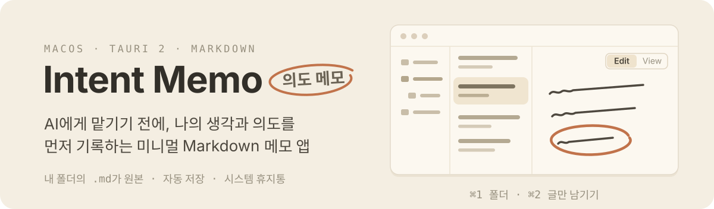

<p align="center"><a href="./README.md">English</a> | 한글</p>

<p align="center">
  
  
  
  
  
  
  
</p>

<p align="center">
  
</p>


**Intent Memo(의도 메모)** 는 AI에게 무언가를 맡기기 전에 인간이 자신의 생각과 의도를 먼저 정리해 기록하는 미니멀 Markdown 데스크톱 앱입니다. 선택한 폴더의 Markdown 파일이 원본이며, 앱은 그 원본을 빠르고 안전하게 쓰고 읽는 데 집중합니다.

## 왜 prompt가 아니라 의도인가

완성된 AI prompt를 작성해 복사하는 PromptPad에서 pivot한 제품입니다. 좋은 prompt보다 먼저 필요한 것은 "내가 무엇을, 왜 원하는가"라는 의도이며, Intent Memo는 그 prompt 이전 단계의 기록에 집중합니다.

<p align="center">
  
</p>

- Markdown editor 기본 기능에서 출발합니다: 빠르고 안전한 작성, 자동 저장, 사용자가 소유하는 로컬 원본.
- 그 위에 목적, 배경, 제약, 완료 조건처럼 의도를 구체화하는 데 필요한 작성 편의 기능을 단계적으로 더합니다.
- AI 기능은 인간이 작성한 원본을 대체하지 않는 파생 계층으로만 후속 버전에서 검토합니다.

## v0.1

- 단일 Markdown library와 임의 깊이의 폴더
- 문서·폴더 생성, 이름 변경, 이동, 시스템 휴지통 이동
- CodeMirror 6 Markdown syntax highlighting
- 500ms autosave, atomic write, 외부 변경 충돌 보호
- 동일 문서의 `Edit` / rendered `View`
- `⌘1` 폴더 pane, `⌘2` content-only 전환
- OS light/dark와 고정 CJK typography

검색, tags, Markdown toolbar, 이미지, wiki/backlink, LLM runtime과 AI 관리 폴더는 후속 범위입니다.

## Data

첫 실행에서 사용자가 `libraryRoot`를 선택합니다. 파일명은 제목의 source of truth이며, 새 문서는 최소 frontmatter와 빈 본문으로 시작합니다.

```markdown
---
created: 2026-08-02T00:00:00.000Z
updated: 2026-08-02T00:00:00.000Z
---
```

숨김 경로와 symlink는 탐색하지 않습니다. 삭제는 영구 삭제 대신 운영체제 휴지통을 사용합니다. 설정은 bundle ID `app.tkbetter.intentmemo`의 OS app-data 위치에 `settings.json`으로 저장됩니다.

## Development

Prerequisites: Node.js 18+, pnpm, Rust, and the [Tauri prerequisites](https://v2.tauri.app/start/prerequisites/).

```bash
pnpm install
pnpm tauri:dev
```

```bash
pnpm check
pnpm test
pnpm build
cargo test --manifest-path src-tauri/Cargo.toml
pnpm tauri:build
```

`pnpm check` is non-mutating. Use `pnpm biome check --write .` when formatting is intended.

## Release

첫 Intent Memo 릴리스는 `v0.1.0`입니다. 태그 생성 전에 기존 PromptPad 릴리스와 `v0.1.x` 태그를 저장소에서 삭제해 greenfield `0.1.0` 라인을 깨끗하게 시작합니다. 소스는 이미 `0.1.0`이므로 첫 릴리스는 `pnpm release` 없이 태그를 직접 생성하고, 두 번째 릴리스부터 `pnpm release patch`, `pnpm release minor`, `pnpm release major` 중 하나를 사용합니다.

A `v*` tag triggers the signed macOS release workflow. Publishing the draft release triggers `.github/workflows/homebrew-bump.yml`, which renders `distribution/homebrew/intent-memo.rb` with release checksums and updates `tkhwang/homebrew-tap`. The repository secret `TAP_GITHUB_TOKEN` must have Contents write access to that tap.

## Stack

- Tauri 2 / Rust
- React 19 / TypeScript
- CodeMirror 6
- react-markdown + remark-gfm
- Biome / Vitest
