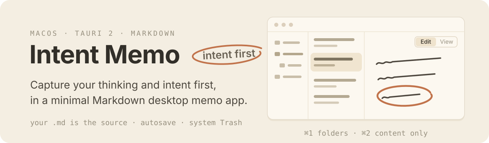
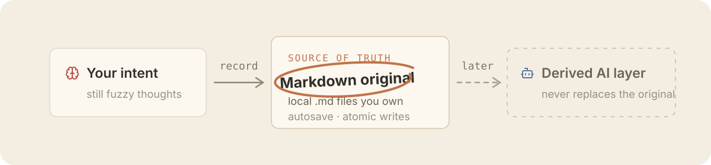

<p align="center">English | <a href="./README.ko.md">한글</a></p>

<p align="center">
  
  
  
  
  
  
  
</p>

<p align="center">
  
</p>

**Intent Memo (의도 메모)** is a minimal Markdown desktop app for writing down your own thinking and intent before handing anything to AI. The Markdown files in the folder you choose are the originals; the app focuses on writing and reading those originals quickly and safely.

## Why intent, not prompts

Intent Memo pivoted from PromptPad, a tool for composing and copying finished AI prompts. What you need before a good prompt is intent — what you want, and why. Intent Memo focuses on that pre-prompt record.

<p align="center">
  
</p>

- It starts from Markdown editor fundamentals: fast and safe writing, autosave, and local originals you own.
- On top of that, it gradually adds writing conveniences that help make intent concrete — purpose, background, constraints, and completion criteria.
- AI features will be considered only in later versions, as a derived layer that never replaces what a human wrote.

## v0.1

- A single Markdown library with folders of arbitrary depth
- Create, rename, and move documents and folders; delete to the system Trash
- CodeMirror 6 Markdown syntax highlighting
- 500 ms autosave, atomic writes, external-change conflict protection
- `Edit` / rendered `View` of the same document
- `⌘1` folder pane toggle, `⌘2` content-only mode
- OS light/dark and fixed CJK typography

Search, tags, a Markdown toolbar, images, wiki/backlinks, an LLM runtime, and AI-managed folders are follow-up scope.

## Data

On first run you pick a `libraryRoot`. The filename is the source of truth for a document's title, and new documents start with minimal frontmatter and an empty body.

```markdown
---
created: 2026-08-02T00:00:00.000Z
updated: 2026-08-02T00:00:00.000Z
---
```

Hidden paths and symlinks are not traversed. Deletion uses the operating system Trash instead of permanent deletion. Settings are stored as `settings.json` in the OS app-data location for bundle ID `app.tkbetter.intentmemo`.

## Development

Prerequisites: Node.js 18+, pnpm, Rust, and the [Tauri prerequisites](https://v2.tauri.app/start/prerequisites/).

```bash
pnpm install
pnpm tauri:dev
```

```bash
pnpm check
pnpm test
pnpm build
cargo test --manifest-path src-tauri/Cargo.toml
pnpm tauri:build
```

`pnpm check` is non-mutating. Use `pnpm biome check --write .` when formatting is intended.

## Release

The version and tag for the first Intent Memo release are not decided yet. Because they would collide with the previous PromptPad `v0.1.x` tags, we do not run `pnpm release patch` at the current `0.1.0`.

A `v*` tag triggers the signed macOS release workflow. Publishing the draft release triggers `.github/workflows/homebrew-bump.yml`, which renders `distribution/homebrew/intent-memo.rb` with release checksums and updates `tkhwang/homebrew-tap`. The repository secret `TAP_GITHUB_TOKEN` must have Contents write access to that tap.

## Stack

- Tauri 2 / Rust
- React 19 / TypeScript
- CodeMirror 6
- react-markdown + remark-gfm
- Biome / Vitest
